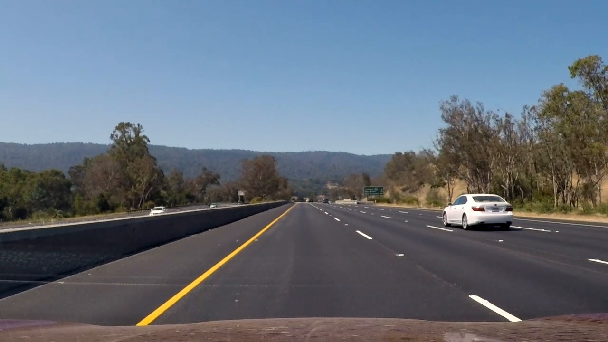

**Vehicle Detection Project**

This code tracks vehicles in a video stream. Given a video recorded from a car's front-facing camera, it produces an output video with labels around the detected vehicles. I wrote it as part of Udacity's Self-Driving Car Engineer nanodegree program.

The goals / steps of this project are as follows:

* Train a classifier to determine whether a 64x64 image contains a vehicle.
* Implement a sliding-window technique and use the trained classifier to search for vehicles in a single image.
* Run the detection on a video stream and create a heat map of recurring detections frame by frame to reject outliers and follow detected vehicles.
* Estimate a bounding box for vehicles detected.

---

### The Classifier

I used a Linear SVM classifier, trained on a labeled set of images, with features extracted using Histogram of Oriented Gradients (HOG), spatial color-binning, and color histograms.

The code for this step is in classifier.py:
* train() is the main method that loads the training set, extracts features, trains, and persists the SVM classifier
* extract_features() extracts all features from an image, using color_hist(), bin_spatial(), and get_hog_features()
* is_car() uses the trained SVM to infer whether a 64x64 image contains a car

The feature extraction code is identical for both training and inference. Since my initial stab achieved 98% test accuracy,
I didn't experiment too much with extraction parameters for either HOG or color features:
* HOG on all HSV channels, 8x8 cells, 2x2 blocks
* Spatial binning of HSV to 16x16 squares
* Histogram of HSV to 16 bins

As usual, the choice of data had a major impact on detection quality. After initially getting middling results , I tried
training the classifier with much more data extracted from Udacity's open source repository, but I found that accuracy
decreased because the data is so diverse, it was hard to tune a classifier that generalized well. I then tried the
opposite approach - limiting the training data to only GTI data (excluding KITTI), after noticing that the GTI examples
are most similar to the project video. In this very restricted scenario, training data that is more homogenous proved better for the task.

###Sliding Window Search

I search the lower half of the image using two different window sizes. I created a small interactive UI to cycle
through my test images and tweak the parameters (window size, overlap) for each tier.

Overlapping search windows:

Detected car bounding boxes:

The source code can be found here:
* image_searcher.py - Search through a large image and return the search windows where a car was found
* test_image_processor.py - interactive UI for searching through a set of test images and tweaking the search parameters

---

### Video Implementation

[The output video can be found here](./project_video_out.mp4)

Video processing works as follows:
* Perform a sliding window search in each frame of video
* Create a heatmap by adding up the detections from the previous X frames
* Apply a minimum threshold to the heatmap to drop false positive detections
* scipy.ndimage.measurements.label() to label contiguous blobs in the heatmap
* Assume each blob is a car, and calculate its bounding box

|         |         |  
|:-------------:|:-------------:|:-------------:|
| 1. Input image     | 2. Single-image detection | Heatmap of previous 20 frames' detection |
|       |         |  
| 4. Labeled thresholded heatmap   | 5. Annotated image |

---

###Discussion

In order to achieve good detection stability across frames, I had to consider a large number of previous frames (20) which
would introduce an unacceptable latency in real-life situations. To get around this, I would need to improve the
robustness of my classifier. My main bottleneck in doing so is the slow iteration time, combined with the large number
of parameters to tweak and test.

I would address these problems as follows:

* Performance
    * For each window size, scale the entire image once so that each search window is (64x64), instead of scaling each search window individually.
    * Similarly, extract HOG features once per scale, rather than redundantly for each search window.
* Parameter search - having a labeled video would enable doing an automated parameter search to improve pipeline performance
